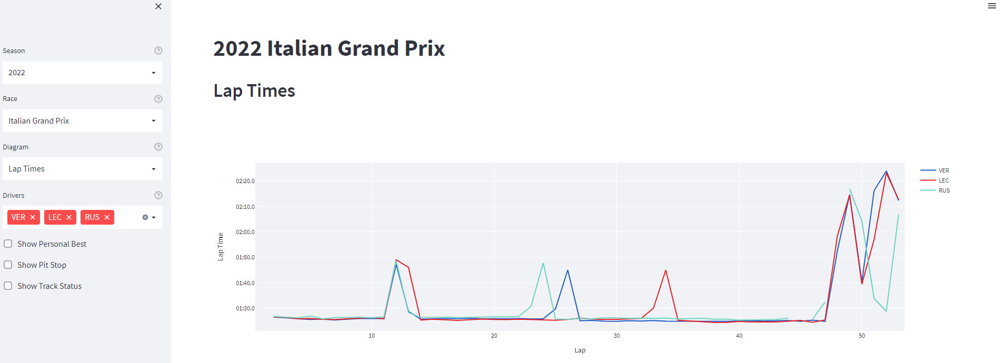

# F1 Analytics

This repo contains code to do analytics on F1 data. All data is sourced from the `fastf1` package. A `streamlit` dashboard allows to view and modify all analytics.

## Installation

Create a conda environment via:

```bash
conda env create -f environment.yml
conda activate f1
```

## Dashboard



The dashboard can be started via:

```bash
streamlit run src/app.py
```

The dashboard visualizes data of every formula 1 race since 2018.

The dashboard contains following diagrams:
- `Lap Time`: Shows lap times of selected drivers
- `Lap Time Difference`: Difference of one driver to selection of drivers
- `Driver Position`: Position of each driver per lap
- `Gap to Leader`: Time difference of each driver to current race laeder
- `Stints`: Tyre choice of each driver
- `Pit Times`: Time of each pit stop (from pit entry until pit exit)
- `Fastest Lap`: Fastest lap of each driver
- `Top Speed`: Highest speed of each driver during the race

Some diagrams of following features:
- `Show Personal Best`: Highlight fastest lap of each driver
- `Show Pit Stop`: Highlight lap when driver had a pit stop
- `Show Track Status`: Highlight laps with VSC or Safety Car
